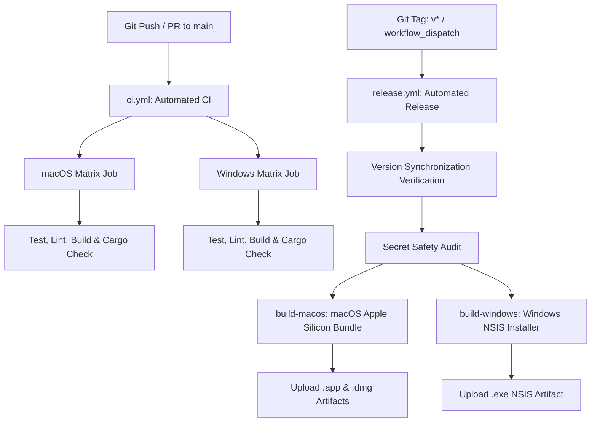

# NearShare Cross-Platform CI/CD & Release Pipeline

> **Document Version**: `1.0.0`  
> **Product Version**: NearShare `0.1.0`  
> **Target Platforms**: macOS 11+ (Apple Silicon `aarch64`), Windows 10/11 (`x86_64`)  
> **CI/CD Platform**: GitHub Actions

---

## 1. Pipeline Overview

NearShare employs a dual-workflow GitHub Actions CI/CD automation foundation designed for continuous validation, automated cross-platform bundling, and strict release hygiene.

---

## 2. Workflows & Triggers

### 2.1 Continuous Integration (`.github/workflows/ci.yml`)
- **Triggers**:
  - `push` to `main`, `master`
  - `pull_request` against `main`, `master`
  - `workflow_dispatch` (manual execution)
- **Matrix Runners**:
  - `macos-14` (Apple Silicon M-series ARM64 runner)
  - `windows-latest` (Windows Server / Windows 11 x64 runner)
- **Execution Pipeline**:
  1. `actions/checkout@v4` — Shallow clone of repository.
  2. `actions/setup-node@v4` — Installs Node.js 24 with npm cache.
  3. `npm ci` — Installs locked dependencies.
  4. `npm run validate:version` — Enforces version consistency across manifests.
  5. `npm run check:secrets` — Scans for accidental key or credential commits.
  6. `npm test` — Executes 400 deterministic unit, motion, and contract tests.
  7. `npm run lint` — Runs `oxlint` with 0-error enforcement.
  8. `npm run build` — Compiles TypeScript (`tsc -b`) and bundles Vite client.
  9. `dtolnay/rust-toolchain@stable` + `swatinem/rust-cache@v2` — Installs Rust compiler and caches Cargo target dependencies.
  10. `cargo check --manifest-path src-tauri/Cargo.toml` — Type-checks Rust backend.
  11. `cargo test --manifest-path src-tauri/Cargo.toml` — Runs native Rust test suite.

---

### 2.2 Release Pipeline (`.github/workflows/release.yml`)
- **Triggers**:
  - `push` with Git tag pattern `v*` (e.g. `v0.1.0`)
  - `workflow_dispatch` with optional `version_tag` input parameter.
- **Jobs**:
  1. `build-macos` (`macos-14`):
     - Validates version against tag.
     - Runs secret audit, tests (400 passing), lint, and frontend build.
     - Compiles native Tauri macOS release bundle (`cargo tauri build`).
     - Uploads `nearshare-macos-dmg` (`NearShare_0.1.0_aarch64.dmg`) and `nearshare-macos-app` (`NearShare-app-macos-aarch64.tar.gz`).
  2. `build-windows` (`windows-latest`):
     - Validates version against tag.
     - Runs secret audit, tests (400 passing), lint, and frontend build.
     - Compiles native Windows NSIS release installer (`cargo tauri build --bundles nsis`).
     - Uploads `nearshare-windows-installer` (`NearShare_0.1.0_x64-setup.exe`).

---

## 3. Version Synchronization & Tag Contract

To guarantee release integrity, the version synchronization validator (`scripts/validate-version.ts`) verifies:
- `package.json` $\equiv$ `src/core/appVersion.ts` (`APP_VERSION`) $\equiv$ `src-tauri/tauri.conf.json` (`version`) $\equiv$ `src-tauri/Cargo.toml` (`[package].version`).
- On tag builds, the Git tag (e.g. `v0.1.0` or `refs/tags/v0.1.0`) is stripped of the `v` prefix and strictly matched against `0.1.0`. Any mismatch halts the release job immediately.

---

## 4. Code Signing & Notarization Scaffolding

NearShare includes non-blocking code signing scaffolding prepared for production certificate attachment:

### macOS Signing & Notarization
When repository secrets are configured, Tauri will automatically sign and notarize the macOS application:
- `APPLE_CERTIFICATE`: Base64-encoded Developer ID Application `.p12` certificate.
- `APPLE_CERTIFICATE_PASSWORD`: Password protecting the `.p12` certificate.
- `APPLE_SIGNING_IDENTITY`: Code signing identity name (e.g. `"Developer ID Application: Company Name (TEAMID)"`).
- `APPLE_ID`: Apple ID email address.
- `APPLE_PASSWORD`: App-specific password generated on appleid.apple.com.
- `APPLE_TEAM_ID`: 10-character Apple Developer Team ID.

*Current Status:* **UNSIGNED / NOT NOTARIZED** development builds.

### Windows Authenticode Signing
When repository secrets are configured, Tauri will sign the NSIS installer:
- `WINDOWS_CERTIFICATE`: Base64-encoded Authenticode `.pfx` certificate.
- `WINDOWS_CERTIFICATE_PASSWORD`: Password for the `.pfx` certificate.

*Current Status:* **UNSIGNED** NSIS executable.

---

## 5. Security & Secret Audit Policy

The pre-packaging security scanner (`scripts/check-secrets.ts`) prevents accidental leaks:
- Inspects all tracked source code for unencrypted private key blocks, GitHub Personal Access Tokens, AWS keys, Slack/Discord webhooks, and `.env` files.
- Operates under strict **zero secret echoing**: secret values are never printed in CI logs or output streams.
- Differentiates synthetic mock strings in test suites from production source code.

---

## 6. Verification Status Matrix

| Component / Platform | macOS Apple Silicon | Windows 10/11 | macOS ↔ Windows LAN |
|:---|:---|:---|:---|
| **Local Build & Packaging** | **LOCAL BUILD VERIFIED** | **NOT AVAILABLE (on Mac)** | N/A |
| **CI Workflow Definition** | **CONFIGURED** | **CONFIGURED** | N/A |
| **Deterministic Tests** | **400 / 400 PASSED** | **400 / 400 PASSED (Harness)** | **400 / 400 PASSED** |
| **Code Signing** | **UNSIGNED (Scaffolded)** | **UNSIGNED (Scaffolded)** | N/A |
| **Notarization** | **NOT NOTARIZED** | N/A | N/A |
| **Physical Hardware Transfer** | **PHYSICAL MACOS VERIFIED** | **NOT VERIFIED** | **NOT VERIFIED** |

> **Classification Meanings:**
> - `LOCAL BUILD VERIFIED`: Actually compiled and verified on local development machine.
> - `CONFIGURED`: Workflow scripts created and validated locally.
> - `NOT VERIFIED`: Physical secondary hardware not attached.
