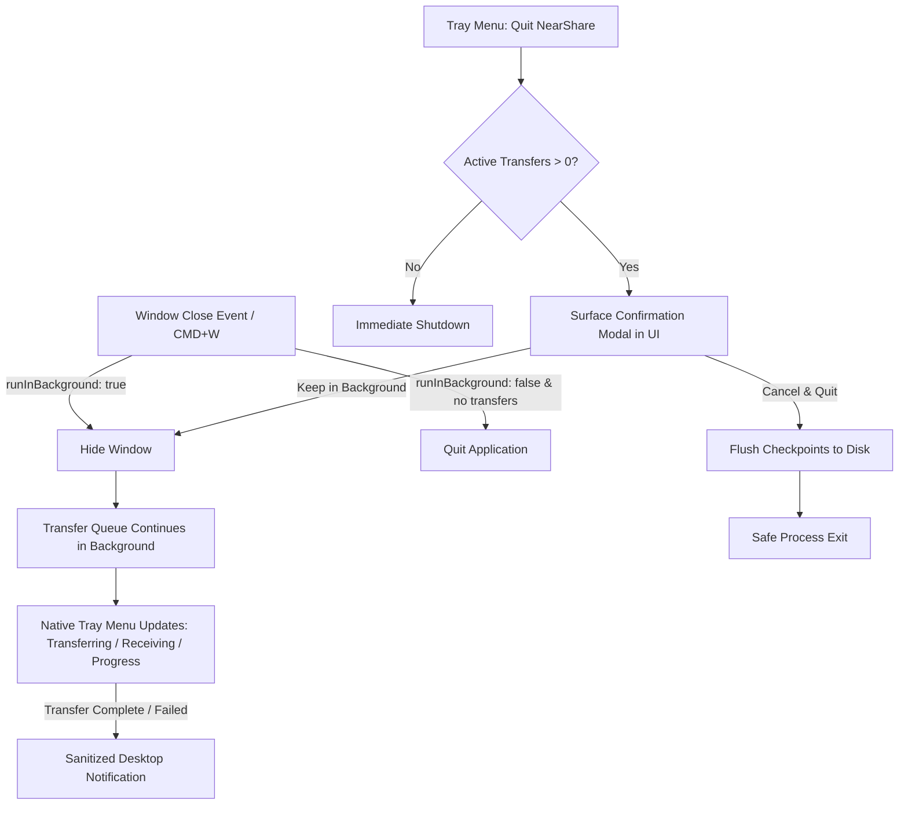

# NearShare Desktop Lifecycle & System Tray Architecture

> **Document Version**: `1.0.0`  
> **Product Version**: NearShare `0.1.0`  
> **Target Framework**: Tauri v2 (`2.12.0`)  
> **Applicable Platforms**: macOS (Menu Bar / Status Item) & Windows (System Tray - Prepared)

---

## 1. Overview & Architecture

NearShare integrates directly with the native desktop shell using Tauri v2's native Tray Icon API (`tauri::tray::TrayIconBuilder`). This integration enables seamless background transfer execution, menu bar status monitoring, privacy-preserving desktop notifications, and atomic checkpoint flushing during application shutdown.

---

## 2. Background Transfer Boundary (Invariants)

1. **No Separate Daemon Process**:  
   Background transfer in NearShare does **not** introduce a secondary background daemon or separate multi-process worker. The single Tauri application process remains running in memory while the main webview window is hidden.
2. **Single Source of Truth**:  
   The frontend `TransferQueueContext` remains the sole, authoritative source of transfer state. The native shell and tray menu only observe and reflect this state. No duplicate transfer state records exist in Rust.
3. **Execution Continuity**:  
   When the user closes the window (via the red traffic light button on macOS or standard close button on Windows), the window close event is intercepted with `api.prevent_close()` and the window is hidden (`window.hide()`). Active transfers continue uninhibited without socket interruptions.

---

## 3. Native Menu Bar & System Tray Items

The native menu provides quick controls and real-time status reporting:

| Menu Item | Identifier | Function / Behavior |
|:---|:---|:---|
| `NearShare v0.1.0` | `title` | Static disabled header displaying application version. |
| `Status: <State>` | `status` | Reflects high-level state: `Idle`, `Transferring`, `Receiving`, `Interrupted`, `Failed`, `Completed`. |
| `Open NearShare` | `open` | Shows, unminimizes, and brings the main window to front. |
| `New Transfer` | `new_transfer` | Focuses the window and navigates directly to the file composer. |
| `Transfers` | `transfers` | Focuses the window and opens the transfer queue monitor. |
| `Settings` | `settings` | Focuses the window and opens the settings screen. |
| `Quit NearShare` | `quit` | Dispatches `app_quit_requested` to initiate the safe shutdown sequence. |

---

## 4. Safe Shutdown Sequence & Checkpoint Flush

When the user requests to quit NearShare (via Menu Bar Quit, Dock Quit, or App Menu):

1. **Active Transfer Inspection**:  
   The system queries `TransferQueueContext.transfers`. If no transfers are actively transferring or receiving, the application terminates immediately.
2. **User Confirmation**:  
   If one or more transfers are active, NearShare brings the main window to focus and displays a confirmation dialog:
   - **Keep in Background**: Keeps active transfers running and hides the window.
   - **Cancel Transfers & Quit**: Flushes incomplete transfer checkpoints to durable disk persistence (`TransferCheckpointStore.saveDurable`) and exits the process cleanly.
3. **Durable Checkpoint Guarantee**:  
   Checkpoints are written atomically (`<id>.<uuid>.tmp` renamed to `<id>.json`). No partially-written checkpoint files remain on disk.

---

## 5. Startup Recovery Policy

- On application launch, NearShare inspects durable storage via `TransferCheckpointStore.listIncompleteDurable()`.
- Discovered incomplete transfers are presented in the UI under **"Incomplete Transfers Discovered"**.
- **No Automatic Reconnect**: In accordance with NearShare security and user agency policies, the application does **not** automatically open network connections or reconnect to peers upon startup. Resumption requires an explicit user action.

---

## 6. Desktop Notification Policy

Native notifications are delivered through the Tauri notification IPC bridge:

- **Sanitization & Privacy**: Notification titles and bodies contain **only sanitized metadata** (e.g. `"1.2 GB sent to MacBook Air"`).
- **Zero Sensitive Data**: AES keys, ECDH secrets, device private keys, pairing PINs, authentication tokens, and host filesystem absolute paths are strictly stripped from all notification payloads.
- **Spam Prevention**: Notifications are dispatched only for meaningful lifecycle milestones (transfer completed, transfer failed/interrupted, incoming transfer request while hidden). No continuous progress spam is emitted.

---

## 7. Platform Verification Status

| Platform | Menu / Tray Integration | Background Execution | Notifications | Runtime Status |
|:---|:---|:---|:---|:---|
| **macOS (Apple Silicon)** | Native Status Item (`NSStatusItem`) | Window Hide / Background Run | Native macOS UserNotifications | **RUNTIME VERIFIED** |
| **Windows 10/11** | Prepared (`TrayIconBuilder`) | Configured via Tauri Event Loop | Configured (`ToastNotification`) | **CONFIGURED / NOT VERIFIED** |
| **Web Fallback** | In-Memory Mock Fallback | Tab Active Execution | Browser Notification API (if allowed) | **VERIFIED (Mock/Browser)** |

> *Note: Windows runtime verification requires physical execution on Windows hardware.*
