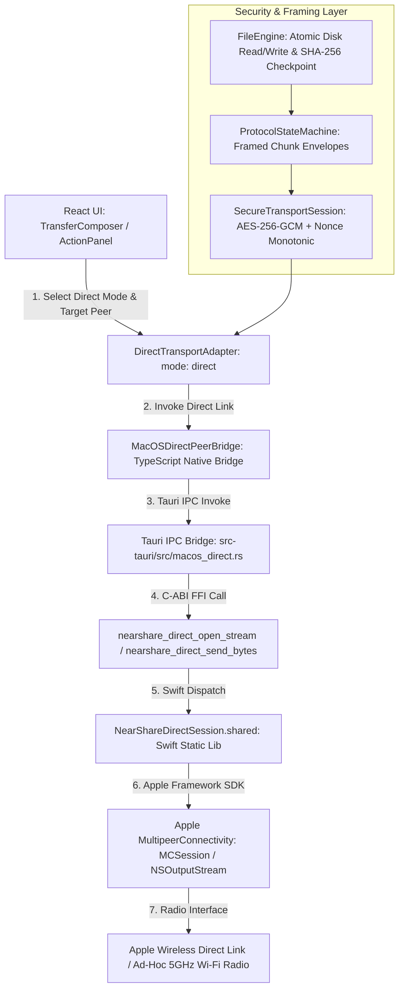

# NearShare — macOS Direct Mode Runtime Architecture & Control Path Audit

## 1. Executive Summary

This document presents a comprehensive, evidence-based audit of the macOS Direct Mode production runtime path in NearShare. It traces the full execution lifecycle from the React frontend to Apple's native MultipeerConnectivity byte-stream interfaces and back.

---

## 2. End-to-End Production Transport Path

---

## 3. Boundary-by-Boundary Specification

| Boundary Layer | Input Data | Output Data | Serialization Format | Ownership Model | Error & Cancellation Handling | Cleanup Mechanism |
|:---|:---|:---|:---|:---|:---|:---|
| **1. UI → Adapter** | `TransportDevice`, file payload manifest | Logical transfer initiation promise | TypeScript objects | React Context (`TransferQueueContext`) | User cancel via `transfer.cancel()`; updates state to `cancelled` | Clears queue items and active listeners |
| **2. Adapter → TS Bridge** | `peerId: string`, `options?: DirectDiscoveryOptions` | `MacOSDirectConnectionInfo` | Plain JavaScript primitives & objects | Singleton `MacOSDirectPeerBridge` instance | Catches IPC exceptions, maps to `SafeUserError`, dispatches `error` event | `destroy()` clears active maps and event listeners |
| **3. TS Bridge → Tauri IPC** | Typed IPC command name + JSON arguments (`peerId`, `bytesBase64`) | `Result<T, String>` | Tauri standard IPC JSON envelope + base64 binary | Tauri WebView IPC serialization | Invocation rejected on native errors; mapped to safe codes | Destroys event subscriptions on window unmount |
| **4. Tauri IPC → Rust FFI** | Rust `String`, `&str`, decoded `Vec<u8>` byte buffers | `c_int`, `*const c_char`, `bool` | C-ABI `CString`, `*const u8`, `c_char` buffer pointer | Rust owns temporary FFI allocations; cloned before C call | Null-checked pointers, checked UTF-8 conversions | Dropped on function exit |
| **5. Rust FFI → Swift Native** | C-compatible pointers & lengths | `@_cdecl` Swift methods | Raw binary byte pointer `UnsafePointer<UInt8>` | Swift `Data(bytes:count:)` copies buffer immediately | Returns `-1` on stream full/error; returns `false` on missing peer | Managed by `NearShareDirectSession` queue |
| **6. Swift → MultipeerConnectivity** | Swift `Data`, `MCPeerID` | `NSOutputStream.write()`, `NSInputStream.read()` | Continuous streaming byte channel | Managed by Apple OS Multipeer subsystem | Stream error events trigger `.errorOccurred` / `.endEncountered` | `close()`, `remove(from:forMode:)`, and `delegate = nil` |
| **7. Stream → Secure Transport** | Plaintext protocol chunk payload | Authenticated ciphertext envelope (AES-256-GCM) | AEAD envelope + 16-byte authentication tag + nonce | `SecureTransportSession` per ephemeral connection | Cryptographic verification failure drops frame immediately | Invalidation wipes symmetric keys from memory |
| **8. Protocol → FileEngine** | Decrypted protocol payload (`CHUNK_DATA`) | Verified file chunks committed to disk | 4-byte BE length-prefixed protocol frames | `FileEngine` and OS disk filesystem | Transient errors trigger checkpoint retry; fatal errors abort | Closes file descriptors and syncs `.tmp` files atomically |

---

## 4. Mock & Fallback Exclusion Policy

- **No Silent Wi-Fi Fallback**: Direct Mode will NEVER secretly route traffic over a local Wi-Fi router if ad-hoc direct link fails.
- **No Production Mock Selection**: `ProductionTransportFactory` strictly rejects mock transports when native runtime is active on macOS.
- **Fail-Closed Principle**: If Apple Multipeer initialization or stream allocation fails, the transfer terminates with an explicit `ERR_DIRECT_TRANSPORT_UNAVAILABLE` rather than faking progress.

---

## 5. Verification Status

- **Architecture**: `SUPPORTED`
- **Native Implementation**: `IMPLEMENTED` (`NearShareDirect` Swift static library compiled & linked)
- **Physical Validation**: `UNVERIFIED` (Single Mac host; physical 2-device validation pending secondary Mac)
