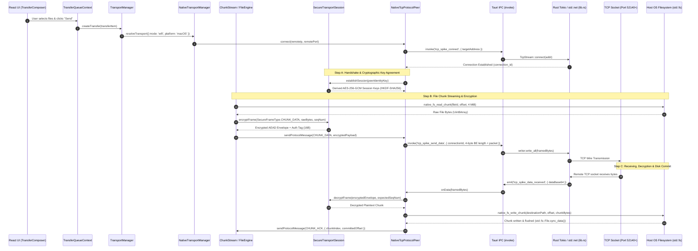
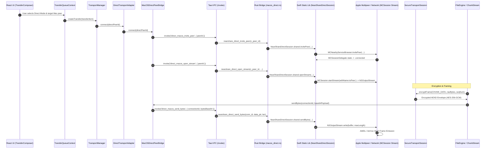

# NearShare Native Runtime Code Paths & Byte Flow

> Traces the exact control flow, memory buffers, cryptographic operations, and socket/stream transport paths across NearShare subsystems.

---

## 1. End-to-End File Transfer Byte Path (macOS / Windows LAN Mode)



---

## 2. End-to-End File Transfer Byte Path (macOS Direct Mode — Multipeer / AWDL)



---

## 3. Storage & Checkpoint Atomic Path

```
Transfer in progress...
       ↓
Committed ByteRange merged ([0..524288] + [524288..1048576] -> [0..1048576])
       ↓
ResumeCheckpoint serialized to JSON
       ↓
Tauri IPC: `native_fs_atomic_replace(targetPath, checkpointJson)`
       ↓
Rust: Write to temporary file `<targetPath>.<uuid>.tmp`
       ↓
Rust: `std::fs::File::sync_all()`
       ↓
Rust: `std::fs::rename(tmpPath, targetPath)` (Atomic OS replacement)
       ↓
Checkpoint safely committed on disk without corruption risk
```
