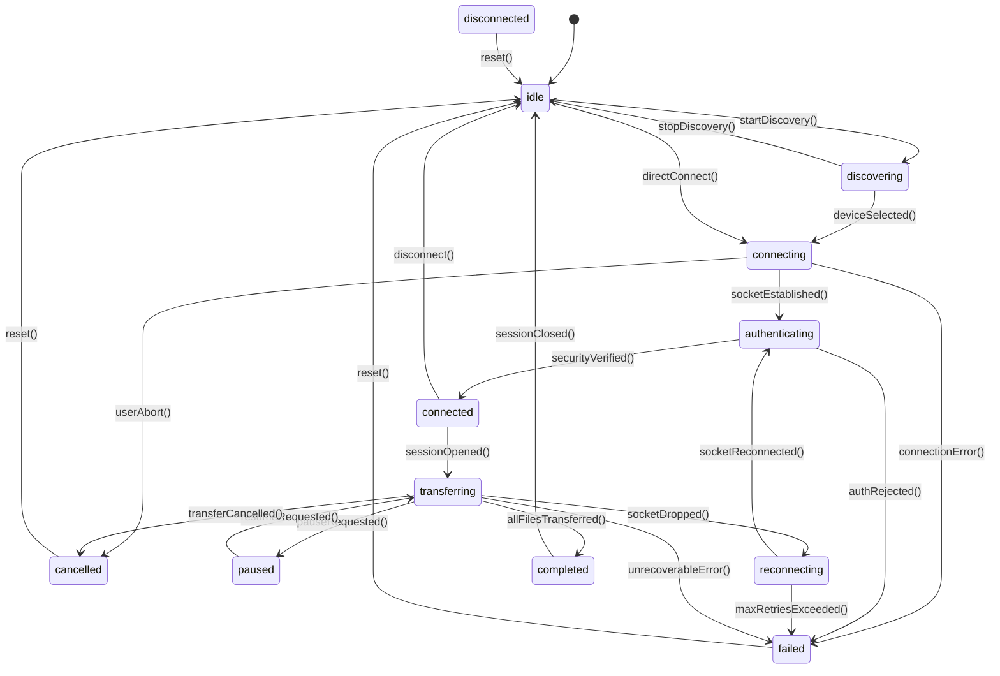

# NearShare Native Transport Lifecycle Specification

## 1. State Machine Definition

The native transport lifecycle governs low-level connection states, peer authentication, payload streaming, pause/resume cycles, and recovery:

---

## 2. Detailed State Transition Matrix

| Current State | Allowed Target States | Description / Action |
| :--- | :--- | :--- |
| **`idle`** | `discovering`, `connecting`, `disconnected` | Rest state; no active sockets or discovery beacons. |
| **`discovering`** | `idle`, `connecting`, `failed`, `disconnected` | Active mDNS / BLE discovery listening for candidate peers. |
| **`connecting`** | `authenticating`, `connected`, `failed`, `disconnected`, `cancelled` | TCP / AWDL / Wi-Fi Direct socket handshaking in progress. |
| **`authenticating`** | `connected`, `failed`, `disconnected`, `cancelled` | Identity verification, PIN check, and AES-GCM session key derivation. |
| **`connected`** | `transferring`, `idle`, `disconnected`, `failed`, `cancelled` | Channel authenticated; idle waiting for transfer session start. |
| **`transferring`** | `paused`, `completed`, `reconnecting`, `failed`, `cancelled`, `disconnected` | Active backpressured chunk streaming and ACK verification. |
| **`paused`** | `transferring`, `cancelled`, `failed`, `disconnected` | Streaming halted; memory buffers drained; durable checkpoint saved. |
| **`reconnecting`** | `authenticating`, `connected`, `failed`, `disconnected`, `cancelled` | Transient network drop; attempting socket re-establishment with stable transfer ID. |
| **`completed`** | `idle`, `disconnected` | All manifest files verified and written; checkpoints cleared. |
| **`disconnected`** | `idle`, `connecting`, `discovering` | Channel closed cleanly or remotely terminated. |
| **`failed`** | `idle`, `reconnecting`, `connecting` | Unrecoverable transport, protocol, or security error encountered. |
| **`cancelled`** | `idle`, `disconnected` | Transfer aborted by sender or receiver request. |

---

## 3. ID Stability & Continuity Across Reconnections

When a connection drops and enters `reconnecting`:
- **Ephemeral IDs (Rotated)**: Sockets receive a new `connectionId` and `sessionId` upon re-authentication.
- **Logical IDs (Preserved)**: The `transferId`, manifest file IDs, and byte offset checkpoints remain unchanged.
- **Resumption Invariant**: Senders resume strictly from receiver-authoritative missing byte ranges without full restart.

---

## 4. Resource Cleanup Invariants

1. **On `paused`**: Unacknowledged in-flight chunk permits are drained; file handles remain open or flushed.
2. **On `cancelled`**: Active file streams are aborted, temporary buffers purged, and socket handles deallocated.
3. **On `completed`**: Destination files are atomic-synced, checksums locked, and session resources freed.
4. **On `failed`**: Unrecoverable sessions log diagnostics to telemetry and release socket and memory resources.
