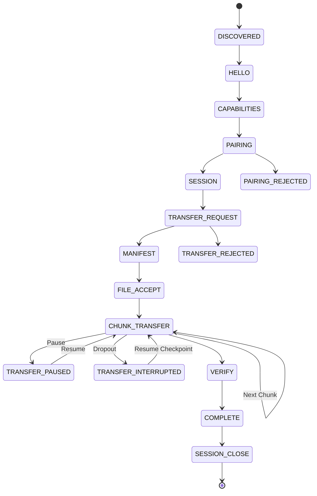

# NearShare Cross-Platform Transfer Protocol Specification (v1.0)

This document defines the versioned, platform-neutral **NearShare Transfer Protocol** (`NearShare v1.0`).

The NearShare protocol establishes how heterogeneous devices (macOS, Windows, Android, iOS, Web) discover, negotiate capabilities, pair, establish sessions, exchange file manifests, stream binary chunks, pause/resume transfers, and verify payload completion **without coupling peers to platform-specific or transport-specific implementations**.

---

## 1. Protocol Architecture & Layer Boundaries

The NearShare system adheres strictly to decoupled layer boundaries:

```
┌────────────────────────────────────────────────────────┐
│                   Application Layer                    │
│      (React UI, Transfer Queue, Review, Settings)       │
└───────────────────────────┬────────────────────────────┘
                            │
┌───────────────────────────▼────────────────────────────┐
│                NearShare Protocol Layer                │
│    (Envelope, State Machine, Validation, Lifecycle)    │
│           WHAT peers communicate logically            │
└───────┬───────────────────┬────────────────────┬───────┘
        │                   │                    │
┌───────▼────────┐  ┌───────▼────────┐  ┌────────▼───────┐
│ Security Layer │  │ Transport Layer│  │  File Engine   │
│ (Trust, Keys,  │  │(Direct, Wi-Fi, │  │ (Disk I/O,     │
│  Verification) │  │ Sockets, BLE)  │  │  Chunking)     │
│  WHO is safe   │  │ HOW bytes move │  │ WHERE files sit│
└────────────────┘  └────────────────┘  └────────────────┘
```

### Layer Boundaries:
1. **Protocol ↔ Transport Boundary**:
   - **Protocol** defines **WHAT** peers communicate (messages, envelopes, state, sequences).
   - **Transport** defines **HOW** bytes physically move (Direct P2P, Local Wi-Fi, Sockets, BLE framing).
   - Protocol messages contain *no* IP addresses, MAC addresses, or radio socket descriptors.
2. **Protocol ↔ Security Boundary**:
   - **Security** owns key exchanges, PIN verification algorithms, identity certificates, and cipher suites.
   - **Protocol** provides the framing hooks (`PAIRING_REQUEST`, `PAIRING_VERIFY`, `SESSION_CREATE`).
3. **Protocol ↔ File Engine Boundary**:
   - **File Engine** reads/writes disk blocks, creates chunk byte streams, and computes checksum hashes.
   - **Protocol** communicates relative paths, manifests, chunk indexes, and completion statuses.
   - Protocol messages contain *no* absolute local filesystem paths (`/Users/...` or `C:\...`).

---

## 2. Protocol Versioning & Compatibility

- **Protocol Name**: `NearShare`
- **Protocol Version**: `1.0`
- **Minimum Supported Version**: `1.0`
- **Maximum Supported Version**: `1.0`

### Compatibility Rules
- Protocol version is independent from the application version (e.g. NearShare App 2.4 vs Protocol 1.0).
- SemVer matching rules apply:
  - Major version mismatches (e.g. `1.0` vs `2.0`) are incompatible.
  - Minor versions must fall within the range `[MIN_SUPPORTED_VERSION, MAX_SUPPORTED_VERSION]`.

---

## 3. Message Envelope Specification

Every NearShare protocol message is encapsulated in a strongly-typed envelope:

```typescript
export interface ProtocolMessage<T = unknown> {
  protocol: string;      // "NearShare"
  version: string;       // e.g. "1.0"
  messageId: string;     // Unique identifier (msg_<timestamp>_<rand>)
  type: ProtocolMessageType;
  timestamp: number;     // Unix Epoch in milliseconds
  sessionId?: string;    // Active logical session identifier
  transferId?: string;   // Active transfer operation identifier
  deviceId?: string;     // Originating device ID
  payload: T;            // Message-specific typed payload
}
```

---

## 4. Message Types & Sequence

| Message Type | Direction | Description |
| :--- | :--- | :--- |
| `HELLO` | Bidirectional | Peer announcement with identity and base capabilities. |
| `CAPABILITIES` | Bidirectional | Detailed negotiation parameters (modes, chunk limits, resume). |
| `PAIRING_REQUEST` | Initiator → Target | Request trust association with a specific verification method. |
| `PAIRING_RESPONSE` | Target → Initiator | Acceptance or rejection of the pairing request. |
| `PAIRING_VERIFY` | Bidirectional | Delivery of verification payload (PIN / numeric code). |
| `SESSION_CREATE` | Initiator → Target | Initiate a secure, capabilities-bounded session. |
| `SESSION_ACCEPT` | Target → Initiator | Session agreement with finalized `NegotiatedCapabilities`. |
| `SESSION_CLOSE` | Bidirectional | Graceful teardown of the active session. |
| `TRANSFER_REQUEST` | Sender → Receiver | Transfer intent declaration with file counts, total size, mode. |
| `TRANSFER_ACCEPT` | Receiver → Sender | Acceptance of transfer intent. |
| `TRANSFER_REJECT` | Receiver → Sender | Rejection with reason code. |
| `FILE_MANIFEST` | Sender → Receiver | Array of `FileManifestEntry` items (relative paths only). |
| `FILE_ACCEPT` | Receiver → Sender | Subset of accepted file IDs and destination policy. |
| `FILE_REJECT` | Receiver → Sender | Subset of rejected file IDs. |
| `CHUNK_START` | Sender → Receiver | Descriptor for an upcoming binary chunk frame. |
| `CHUNK_DATA` | Sender → Receiver | Chunk payload frame with offset, length, and checksum. |
| `CHUNK_ACK` | Receiver → Sender | Acknowledgment of chunk receipt and validation. |
| `TRANSFER_PAUSE` | Either → Other | Cooperative pause request. |
| `TRANSFER_RESUME` | Either → Other | Resume request with `ResumeCheckpoint[]`. |
| `TRANSFER_CANCEL` | Either → Other | Terminal cancellation of in-flight transfer. |
| `TRANSFER_PROGRESS`| Sender → Receiver | Numeric telemetry (`bytesTransferred`, `speedBytesPerSecond`, `etaSeconds`). |
| `TRANSFER_COMPLETE`| Sender → Receiver | Finalized transfer record with verification status. |
| `TRANSFER_ERROR` | Either → Other | Structured error with retryable/recoverable attributes. |
| `HEARTBEAT` | Bidirectional | Session liveness probe (sequence counter). |
| `GOODBYE` | Bidirectional | Device departure notification. |

---

## 5. Protocol State Machine



### State Guard Rules:
- `CHUNK_DATA` cannot be transmitted before `FILE_ACCEPT`.
- `TRANSFER_COMPLETE` cannot be accepted before an active `TRANSFER_REQUEST` and chunk completion.
- Numeric progress values must remain raw numbers (e.g. `42800000` bytes/sec, never formatted UI strings).

---

## 6. Chunking, Checksums, and Resume Model

### Default Chunk Size
- `DEFAULT_CHUNK_SIZE = 4,194,304` bytes (4 MiB).
- Peers negotiate `maxChunkSize` during the `CAPABILITIES` handshake.

### Chunk Descriptor Schema
```typescript
export interface ChunkDescriptor {
  transferId: string;
  fileId: string;
  chunkIndex: number;
  offset: number;
  length: number;
  totalChunks: number;
  checksum?: string;
  checksumAlgorithm?: 'sha256' | 'other';
}
```

### Resumption via Checkpoints
When a transfer is interrupted or paused:
1. Receiver caches written chunks and returns `ResumeCheckpoint`:
   ```typescript
   export interface ResumeCheckpoint {
     transferId: string;
     fileId: string;
     nextChunkIndex: number;
     bytesReceived: number;
   }
   ```
2. On `TRANSFER_RESUME`, sender verifies `NegotiatedCapabilities.resumeSupport` and resumes dispatching from `nextChunkIndex`.

---

## 7. Error Model

Protocol errors are structured with actionable recoverability attributes:

```typescript
export interface ProtocolError {
  code: ProtocolErrorCode;
  message: string;
  retryable: boolean;
  recoverable: boolean;
  details?: Record<string, unknown>;
}
```

### Error Codes:
- `UNSUPPORTED_VERSION`
- `INVALID_MESSAGE`
- `INVALID_STATE`
- `CAPABILITY_MISMATCH`
- `PAIRING_REQUIRED`
- `PAIRING_FAILED`
- `SESSION_REJECTED`
- `TRANSFER_REJECTED`
- `FILE_REJECTED`
- `CHUNK_FAILED`
- `CHECKSUM_FAILED`
- `TRANSFER_INTERRUPTED`
- `TRANSFER_CANCELLED`
- `RESUME_UNSUPPORTED`
- `TIMEOUT`
- `UNKNOWN`

---

## 8. Development Protocol Inspector

A development-only protocol frame tracer is included in `src/components/ProtocolInspector.tsx`.
- Strictly monochromatic `#08090B`, `#101114`, `#17191D`, `#F5F5F5`, `#A6A8AD`, `#686B72`.
- Integrates with `MockProtocolPeer` to demonstrate loopback handshake, capability negotiation, chunk dispatch, progress telemetry, and session teardown completely in memory.
